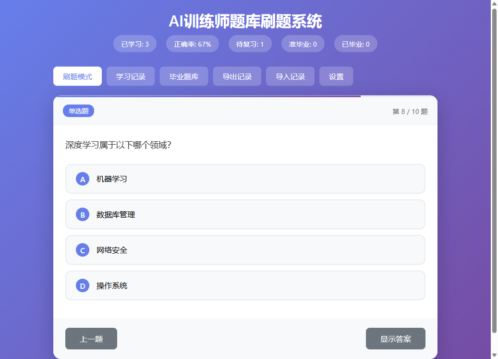
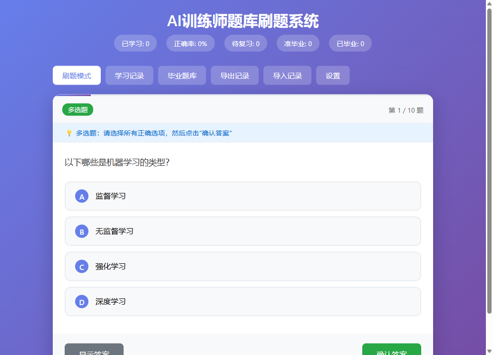
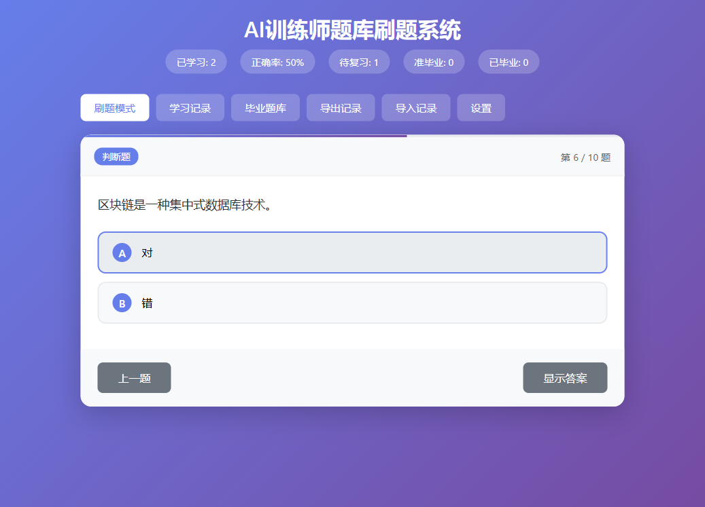
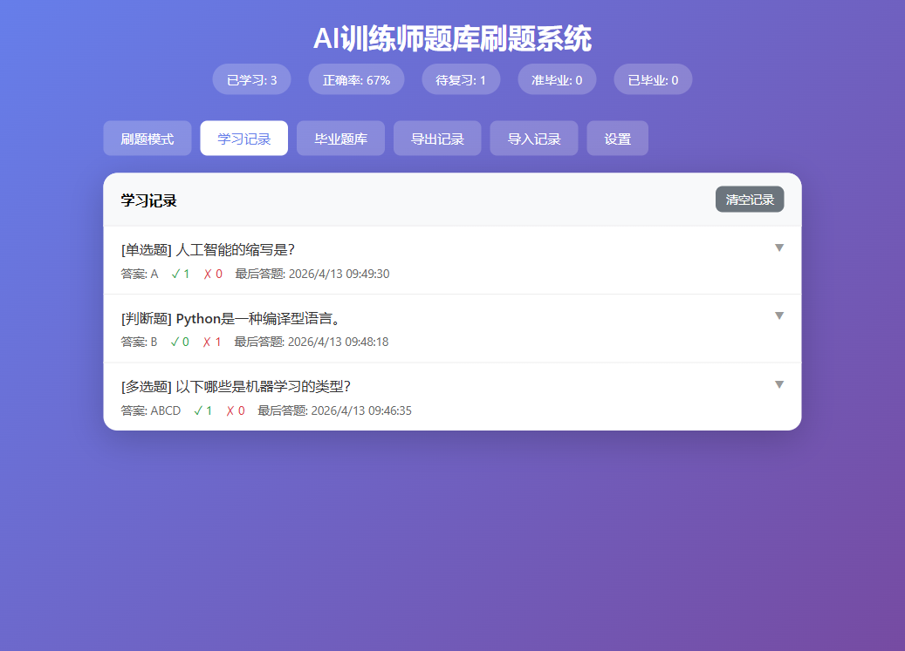
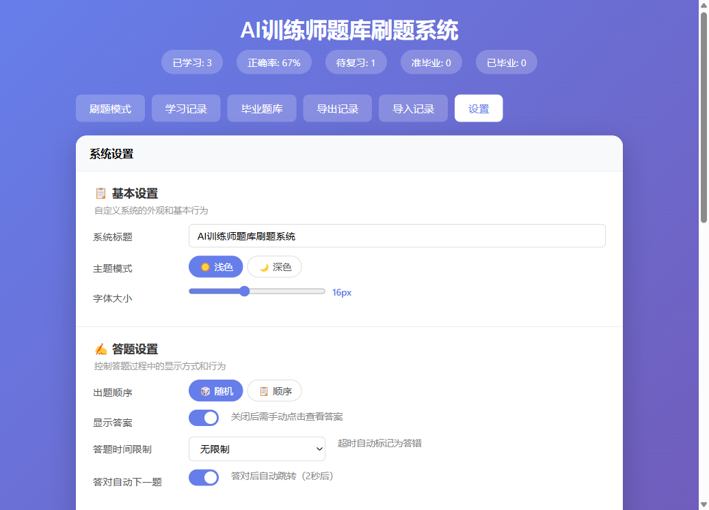
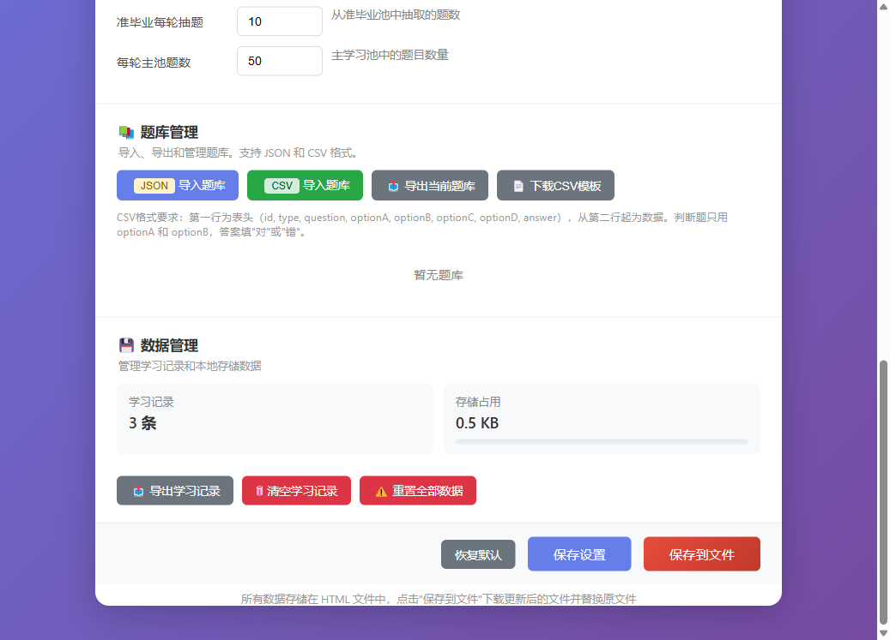

<h1 align="center">通用刷题系统</h1>

一个零依赖、单文件的刷题背题网页应用。导入任意题库即可开始练习，内置艾宾浩斯遗忘曲线间隔重复算法，支持多题库管理。

## 界面预览

<table>
<tr>
<td align="center">单选题（答对）</td>
<td align="center">多选题</td>
</tr>
<tr>
<td></td>
<td></td>
</tr>
<tr>
<td align="center">判断题（答错）</td>
<td align="center">学习记录</td>
</tr>
<tr>
<td></td>
<td></td>
</tr>
<tr>
<td align="center" colspan="2">设置面板（题库管理 / 导入导出）</td>
</tr>
<tr>
<td></td>
<td></td>
</tr>
</table>

## 特点

- **单文件部署** — 整个应用只有一个 `index.html`，双击即可运行，无需服务器、无需安装
- **通用题库** — 支持导入任意题库（CSV / JSON），不绑定任何特定考试内容
- **自包含存储** — 学习记录、设置、题库数据全部保存在 HTML 文件自身中，替换原文件即完成持久化
- **遗忘曲线算法** — 基于艾宾浩斯遗忘曲线的四优先级调度：错题 > 复习到期 > 准毕业巩固 > 新题
- **毕业机制** — 答对足够次数的题目自动毕业不再出现，答错则降级重来
- **多题库切换** — 可导入多个题库，随时切换练习
- **响应式设计** — 适配手机和桌面浏览器

## 使用方法

### 快速开始

1. 双击 `index.html` 打开
2. 点击右上角 **设置** 按钮
3. 点击 **CSV 导入题库** 或 **JSON 导入题库**，选择题库文件
4. 返回主界面开始刷题

### 导入题库格式

#### CSV 格式

表头：`id, type, question, optionA, optionB, optionC, optionD, answer`

示例：

```csv
id,type,question,optionA,optionB,optionC,optionD,answer
1,单选题,人工智能的缩写是？,Artificial Intelligence,Advanced Internet,Automated Integration,Algorithm Index,A
2,多选题,以下哪些是机器学习的类型？,监督学习,无监督学习,强化学习,深度学习,ABCD
3,判断题,Python是一种编译型语言。,对,错,,,B
```

列名兼容多种写法：`question` / `题目` / `问题`，`answer` / `答案` / `正确答案`，`optionA` / `选项A` / `A` 等。其中 `question` 和 `answer` 为必填列。

#### JSON 格式

方式一 — 纯数组：

```json
[
  {"id": 1, "type": "单选题", "question": "...", "options": {"A": "...", "B": "..."}, "answer": "A"}
]
```

方式二 — 带题库名：

```json
{
  "name": "我的题库",
  "questions": [
    {"id": 1, "type": "单选题", "question": "...", "options": {"A": "...", "B": "..."}, "answer": "A"}
  ]
}
```

#### 支持的题型

| 题型 | 答案格式 | 说明 |
|------|---------|------|
| 单选题 | `A` / `B` / `C` / `D` | 单个字母 |
| 多选题 | `AB` / `ACD` / `ABCD` | 多个字母拼接 |
| 判断题 | `对` / `错` | 系统自动生成"对/错"选项 |

### 保存数据

所有数据（学习记录、设置、题库）存储在 HTML 文件自身中。点击设置页的 **保存到文件** 按钮下载更新后的 `index.html`，替换原文件即可。保存时会自动同步当前设置。

### 导出与备份

- **导出题库** — 在设置页点击导出按钮，生成 JSON 文件，可用于分享题库
- **导出学习记录** — 下载 CSV 格式的学习进度
- **导入学习记录** — 从 CSV 文件恢复学习进度

## 复习算法

### 四优先级调度

| 优先级 | 池 | 条件 | 说明 |
|--------|-----|------|------|
| 1 (最高) | 错题池 | 答错过且答对 < 7 次 | 无视复习时间，按错误频率排序优先出题 |
| 2 | 复习池 | 答对 0~6 次，无错题 | 按遗忘曲线到期后出现 |
| 3 | 准毕业池 | 答对 7~9 次 | 每轮随机抽 10 道巩固 |
| 4 | 已毕业 | 答对 >= 10 次 | 永不出现，可在"毕业题库"页查阅 |

### 遗忘曲线间隔

| 答对次数 | 下次复习间隔 |
|---------|------------|
| 1 次 | 5 分钟 |
| 2 次 | 30 分钟 |
| 3 次 | 2 小时 |
| 4 次 | 8 小时 |
| 5 次 | 10 小时 |
| 6 次 | 15 小时 |

间隔可在设置中自定义。

### 答错惩罚

答错一次，该题正确次数 -1（最低为 0）。例如准毕业题（答对 7 次）答错后降回 6 次，重新进入复习池。

### 每轮出题

每轮最多 60 题，由主池题目 + 准毕业巩固（最多 10 题）组成。主池中待复习题目多时全出复习题，少时补充新题。

## 代码结构

整个应用在单个 `index.html` 文件中，按以下区域组织：

```
index.html
├── <style>              # CSS 样式（响应式布局、主题、动画）
├── <body>               # HTML 结构
│   ├── 主界面            # 题目展示、选项按钮、统计栏
│   ├── 学习记录页         # 答题历史列表
│   ├── 毕业题库页         # 已毕业题目查阅
│   ├── 设置面板          # 题库管理、参数配置、导入导出
│   └── <script id="app-data">
│       └── 嵌入式 JSON   # 所有持久化数据存储于此
└── <script>             # JavaScript 逻辑
    ├── 嵌入式数据存储层    # _appData, getEmbeddedData(), setEmbeddedData()
    ├── HTML 重建          # buildHTMLContent() — 生成含最新数据的完整 HTML
    ├── 文件下载           # downloadFile() — 通用下载工具
    ├── 题目管理           # loadQuestions(), generateQuizQueue(), showQuestion()
    ├── 答题逻辑           # 选项点击、判分、记录更新
    ├── 复习调度           # 四优先级排序、遗忘曲线计算
    ├── 设置管理           # applySettings(), saveSettingsFromForm()
    ├── 题库管理           # getAllQuizBanks(), importQuizBank(), switchQuizBank()
    ├── CSV 解析           # parseCSVQuizBank(), parseCSVLine() — RFC 兼容解析器
    └── 导入导出           # CSV/JSON 导入，题库/记录导出
```

### 数据存储模型

不使用 localStorage。数据通过 `<script id="app-data" type="application/json">` 标签嵌入 HTML 文件中，以 JSON 格式存储：

```json
{
  "appState": {
    "records": {},
    "settings": {},
    "quizBanks": {
      "bank_1713000000000": { "name": "我的题库", "questions": [...] }
    },
    "currentQuizBankId": "bank_1713000000000",
    "saveTime": "2026-04-13T00:00:00.000Z"
  }
}
```

保存时 `buildHTMLContent()` 读取当前内存数据，序列化后替换该标签内容，生成完整 HTML 文件供下载。

## 文件说明

```
├── index.html          # 应用本体（单文件，包含全部代码和数据）
├── README.md           # 本文档
├── LICENSE             # GPL 3.0 开源协议
└── screenshots/        # 界面截图
```

## 浏览器要求

Chrome、Edge、Firefox 等现代浏览器。

## Star History

[](https://star-history.com/#maliaosaide/quiz-app&Date)
